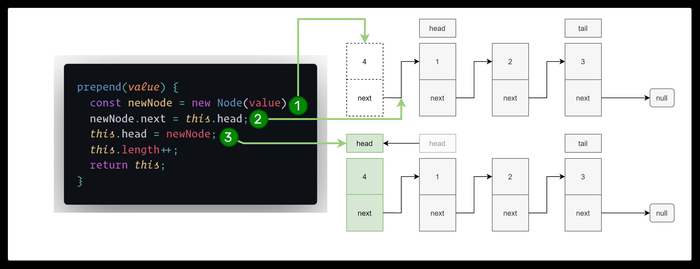
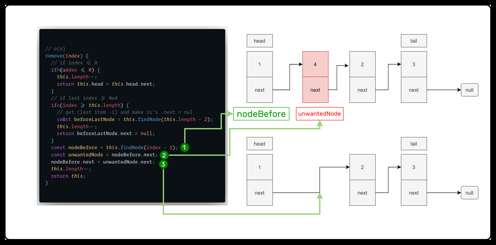
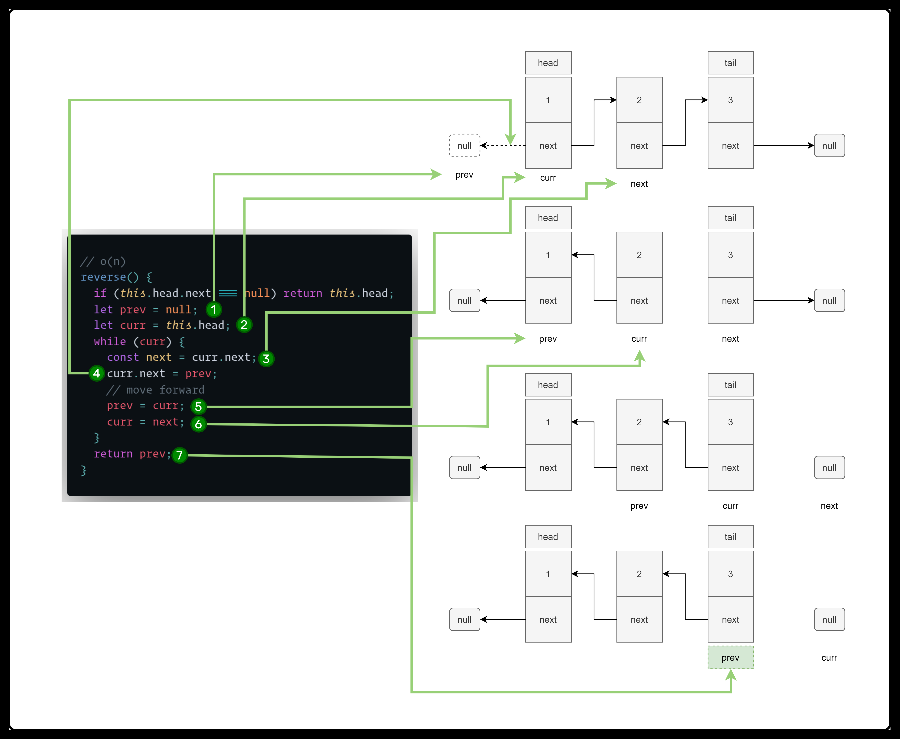

# Data Structures and Algorithms

## Running locally

1. Install the repo.
2. Open in vscode and open `index.html`
3. Open with live server
   [vscode extension](https://marketplace.visualstudio.com/items?itemName=ritwickdey.LiveServer).
4. Include script you want to see it's output in console ex:

```html
<script src="./Tree/BinaryTree.js"></script>
```

---

## LinkedList






